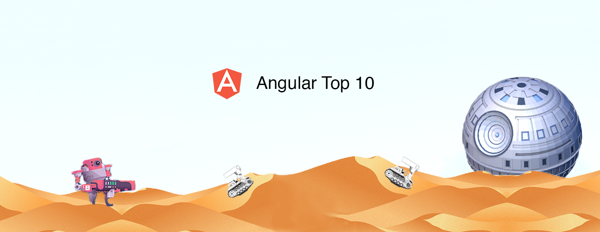

# Angular Top 10 Articles for the Past Month (v.Feb 2018)

</a>

For the past month, we ranked nearly 800 Angular articles to pick the Top 10 stories that can help advance your career (1.25% chance).

* Topics in this list: TypeScript, Web Sockets, Debugging, RxJS, Compile Time & Run Time, Component Dev Kit, Httpclients
* React, Node, Angular, Vue are posted separately
* Also published on [Medium](https://medium.com/@Mybridge/angular-top-10-articles-for-the-past-month-v-feb-2018-d3cf68a814dc)

 

### Course of the month:
[Modern JavaScript From The Beginning: Learn and build projects with pure JavaScript (No frameworks or libraries)](http://bit.ly/2E3RHNo) [6,217 recommends, 4.8/5 stars]

[A) Beginner:](http://bit.ly/2o7paPq) Angular Front To Back. Master Angular 5 from the basics to building an advanced application with Firebase’s Firestore as well as authentication. _[7,186 recommends, 4.7/5 stars]_

[B) RxJS:](http://bit.ly/2F4EJzq) Learn RxJS, Observables + Build Angular 5 Applications in Reactive Programming Style. _[3,670 recommends, 4.2/5 stars]_

 

## Rank 1
### [Real Time Apps with TypeScript: Integrating Web Sockets, Node & Angular](https://medium.com/dailyjs/real-time-apps-with-typescript-integrating-web-sockets-node-angular-e2b57cbd1ec1?utm_source=mybridge&utm_medium=email&utm_campaign=read_more)

 

## Rank 2
### [Angular Debugging "Expression has changed": Explanation (and Fix)](https://blog.angular-university.io/angular-debugging?utm_source=mybridge&utm_medium=email&utm_campaign=read_more)

 

## Rank 3
### [Learn to combine RxJs sequences with super intuitive interactive diagrams](https://blog.angularindepth.com/learn-to-combine-rxjs-sequences-with-super-intuitive-interactive-diagrams-20fce8e6511?utm_source=mybridge&utm_medium=email&utm_campaign=read_more)

 

## Rank 4
### [Introduction to TypeScript](https://toddmotto.com/typescript-introduction?utm_source=mybridge&utm_medium=email&utm_campaign=read_more)

 

## Rank 5
### [Compile-time vs. Runtime configuration of your Angular App](https://juristr.com/blog/2018/01/ng-app-runtime-config?utm_source=mybridge&utm_medium=email&utm_campaign=read_more)

 

## Rank 6
### [Angular as strategy for collaboration and scale - Brad Green - ngAtlanta 2018](https://www.youtube.com/watch?v=tzUVBoZ2qgw?utm_source=mybridge&utm_medium=email&utm_campaign=read_more)

 

## Rank 7
### [A Component Dev Kit for Angular](https://blog.angular.io/a-component-dev-kit-for-angular-9f06e3b4b3b4?utm_source=mybridge&utm_medium=email&utm_campaign=read_more)

 

## Rank 8
### [Building an Angular 5 + Bootstrap 4 application](https://www.youtube.com/watch?v=zEvzW_sSXk0&feature=share?utm_source=mybridge&utm_medium=email&utm_campaign=read_more)

 

## Rank 9
### [Insider’s guide into interceptors and HttpClient mechanics in Angular](https://blog.angularindepth.com/insiders-guide-into-interceptors-and-httpclient-mechanics-in-angular-103fbdb397bf?utm_source=mybridge&utm_medium=email&utm_campaign=read_more)

 

## Rank 10
### [Better Code Organization with Angular DI Multi Option](https://netbasal.com/better-code-organization-with-angular-di-multi-option-31f691918655?utm_source=mybridge&utm_medium=email&utm_campaign=read_more)
