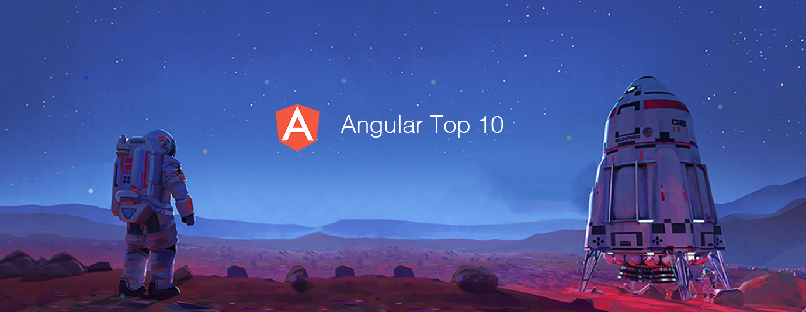

# Angular Top 10 Articles for the Past Month (v.May 2018)

</a>

For the past month, we ranked nearly 800 Angular articles to pick the Top 10 stories that can help advance your career (1.25% chance).

* Topics in this list: Angular 6, Architecture, ng-conf, Angular Universal, Singleton, Bootstrap 4, Tutorial, Web Assembly
* Also published on [Medium](https://goo.gl/TFHcos)

 

### Course of the month:

[A) Beginners: Angular 6 (formerly Angular 2) — The Complete Guide.](http://bit.ly/2D82uW8) [48,237 recommends, 4.7/5 stars]

[B) Build an app with ASPNET Core and Angular from scratch.](http://bit.ly/2IjLeiz) [1,227 recommends, 4.7/5 stars]

 

## Rank 1
### [Version 6 of Angular Now Available](https://blog.angular.io/version-6-of-angular-now-available-cc56b0efa7a4?utm_source=mybridge&utm_medium=blog&utm_campaign=read_more)

 

## Rank 2
### [Architecture in Angular projects](https://medium.com/@cyrilletuzi/architecture-in-angular-projects-242606567e40?utm_source=mybridge&utm_medium=blog&utm_campaign=read_more)

 

## Rank 3
### [Day 1 Keynote - Brad Green, Miško Hevery, Kara Erickson](https://www.youtube.com/watch?v=dIxknqPOWms?utm_source=mybridge&utm_medium=blog&utm_campaign=read_more)

 

## Rank 4
### [Angular Universal: Comprehensive Step-by-Step Guide](https://blog.angular-university.io/angular-universal?utm_source=mybridge&utm_medium=blog&utm_campaign=read_more)

 

## Rank 5
### [Trip report from ng-conf 2018](https://blog.angular.io/trip-report-from-ng-conf-2018-1e8654053205?utm_source=mybridge&utm_medium=blog&utm_campaign=read_more)

 

## Rank 6
### [Angular Services do NOT have to be Singletons](https://netbasal.com/angular-services-do-not-have-to-be-singletons-ffa879e62082?utm_source=mybridge&utm_medium=blog&utm_campaign=read_more)

 

## Rank 7
### [The Best Parts of Bootstrap 4 You are Missing in Angular Material](https://www.amadousall.com/the-good-parts-of-bootstrap-4-you-are-missing-in-your-angular-material-projects?utm_source=mybridge&utm_medium=blog&utm_campaign=read_more)

 

## Rank 8
### [Optimizing an Angular application - Minko Gechev](https://www.youtube.com/watch?v=ybNj-id0kjY?utm_source=mybridge&utm_medium=blog&utm_campaign=read_more)

 

## Rank 9
### [Upgrading an Application to Angular 6: Step By Step](https://blog.codewithdan.com/2018/05/03/upgrading-an-application-to-angular-6-step-by-step?utm_source=mybridge&utm_medium=blog&utm_campaign=read_more)

 

## Rank 10
### [Using Web Assembly to speed up your Angular Application](https://malcoded.com/posts/web-assembly-angular?utm_source=mybridge&utm_medium=blog&utm_campaign=read_more)
