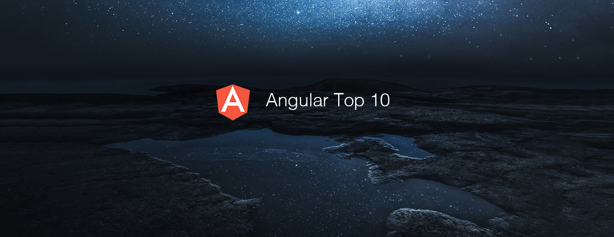

# Angular Top 10 Articles for the Past Month (v.Jun 2018)

</a>

For the past month, we ranked nearly 800 Angular articles to pick the Top 10 stories that can help advance your career (1.25% chance).

* Topics in this list:  Tutorial, Ivy engine, Google I/O, Renderer, Bootstrap 4, Library, Angular Material, Ngrx DevTools, Angular Elements, MEAN Stack
* Also published on [Medium](https://goo.gl/NCZksw)

 

### Course of the month:

[A) Beginners: Angular (Full App) with Angular Material, Angularfire & NgRx.](http://bit.ly/2EuWavj) [1,301 recommends, 4.7/5 stars]

[B) Angular & NodeJS — The MEAN Stack Guide.](http://bit.ly/2HVnkJj) [6,009 recommends, 4.6/5 stars]

 

## Rank 1
### [Build A Real World Beautiful Web APP with Angular 6 — A to Z Ultimate Guide (2018) — PART I](https://medium.com/@hamedbaatour/build-a-real-world-beautiful-web-app-with-angular-6-a-to-z-ultimate-guide-2018-part-i-e121dd1d55e?utm_source=mybridge&utm_medium=blog&utm_campaign=read_more)

 

## Rank 2
### [Ivy engine in Angular: first in-depth look at compilation, runtime and change detection](https://blog.angularindepth.com/ivy-engine-in-angular-first-in-depth-look-at-compilation-runtime-and-change-detection-876751edd9fd?utm_source=mybridge&utm_medium=blog&utm_campaign=read_more)

 

## Rank 3
### [What's new in Angular (Google I/O '18)](https://www.youtube.com/watch?v=jnp_ny4SOQE?utm_source=mybridge&utm_medium=blog&utm_campaign=read_more)

 

## Rank 4
### [Angular Ivy change detection execution: How i prefer debugging new Angular Ivy engine.](https://blog.angularindepth.com/angular-ivy-change-detection-execution-are-you-prepared-ab68d4231f2c?utm_source=mybridge&utm_medium=blog&utm_campaign=read_more)

 

## Rank 5
### [How To Build Responsive Layouts With Bootstrap 4 and Angular 6 ](https://medium.com/@tomastrajan/how-to-build-responsive-layouts-with-bootstrap-4-and-angular-6-cfbb108d797b?utm_source=mybridge&utm_medium=blog&utm_campaign=read_more)

 

## Rank 6
### [The Angular Library Series - Creating a Library with the Angular CLI](https://blog.angularindepth.com/creating-a-library-in-angular-6-87799552e7e5?utm_source=mybridge&utm_medium=blog&utm_campaign=read_more)

 

## Rank 7
### [Creating Beautiful Apps with Angular Material](https://auth0.com/blog/creating-beautiful-apps-with-angular-material?utm_source=mybridge&utm_medium=blog&utm_campaign=read_more)

 

## Rank 8
### [Angular Ngrx DevTools: Important Practical Tips](https://blog.angular-university.io/angular-ngrx-devtools?utm_source=mybridge&utm_medium=blog&utm_campaign=read_more)

 

## Rank 9
### [Building Custom Elements / Web Components with Angular 6](https://medium.com/@tomsu/building-web-components-with-angular-elements-746cd2a38d5b?utm_source=mybridge&utm_medium=blog&utm_campaign=read_more)

 

## Rank 10
### [MEAN Stack Angular 6 CRUD Web Application](https://www.djamware.com/post/5b00bb9180aca726dee1fd6d/mean-stack-angular-6-crud-web-application?utm_source=mybridge&utm_medium=blog&utm_campaign=read_more)
