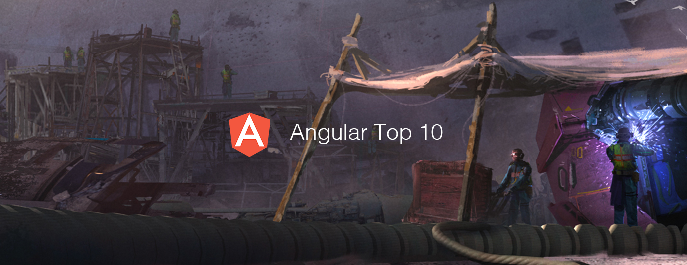

# Angular Top 10 Articles for the Past Month (v.Dec 2018)

</a>

For the past month, we ranked nearly 800 Angular articles to pick the Top 10 stories that can help advance your career (1.25% chance).

* Also published on [Medium](https://goo.gl/rxfzXx)

 

### Course of the month:

 

## Rank 1
### [How to optimize Angular applications](https://itnext.io/how-to-optimize-angular-applications-99bfab0f0b7c?utm_source=mybridge&utm_medium=blog&utm_campaign=read_more)

 

## Rank 2
### [State of JavaScript - Real Analysis of Angular, React, and Vue](https://www.youtube.com/watch?v=UnEPBQvkNrg?utm_source=mybridge&utm_medium=blog&utm_campaign=read_more)

 

## Rank 3
### [A Complete Guide To Routing In Angular](https://www.smashingmagazine.com/2018/11/a-complete-guide-to-routing-in-angular?utm_source=mybridge&utm_medium=blog&utm_campaign=read_more)

 

## Rank 4
### [Creating a toast service with Angular CDK](https://blog.angularindepth.com/creating-a-toast-service-with-angular-cdk-a0d35fd8cc12?utm_source=mybridge&utm_medium=blog&utm_campaign=read_more)

 

## Rank 5
### [Creating Angular Desktop Apps with Electron](https://malcoded.com/posts/angular-desktop-electron?utm_source=mybridge&utm_medium=blog&utm_campaign=read_more)

 

## Rank 6
### [A gentle introduction into change detection in Angular](https://blog.angularindepth.com/a-gentle-introduction-into-change-detection-in-angular-33f9ffff6f10?utm_source=mybridge&utm_medium=blog&utm_campaign=read_more)

 

## Rank 7
### [A Deep Dive Into Angular Animations](https://www.c-sharpcorner.com/article/overview-of-angular-animation?utm_source=mybridge&utm_medium=blog&utm_campaign=read_more)

 

## Rank 8
### [Angular 7 - Role Based Authorization Tutorial with Example](http://jasonwatmore.com/post/2018/11/22/angular-7-role-based-authorization-tutorial-with-example?utm_source=mybridge&utm_medium=blog&utm_campaign=read_more)

 

## Rank 9
### [My favorite state management technique in Angular — RxJS Behavior Subjects](https://medium.com/@rmcavin/my-favorite-state-management-technique-in-angular-rxjs-behavior-subjects-49f18daa31a7?utm_source=mybridge&utm_medium=blog&utm_campaign=read_more)

 

## Rank 10
### [Advanced Angular Elements](https://www.youtube.com/watch?v=ujaMvl5M8nY?utm_source=mybridge&utm_medium=blog&utm_campaign=read_more)

 

## Rank 11
### [Better Redirects in Angular Route Guards](https://juristr.com/blog/2018/11/better-route-guard-redirects?utm_source=mybridge&utm_medium=blog&utm_campaign=read_more)

 

## Rank 12
### [How to Cache HTTP Requests in an Angular App (PWA)](https://christianlydemann.com/how-to-cache-http-requests-in-an-angular-pwa?utm_source=mybridge&utm_medium=blog&utm_campaign=read_more)

                    
